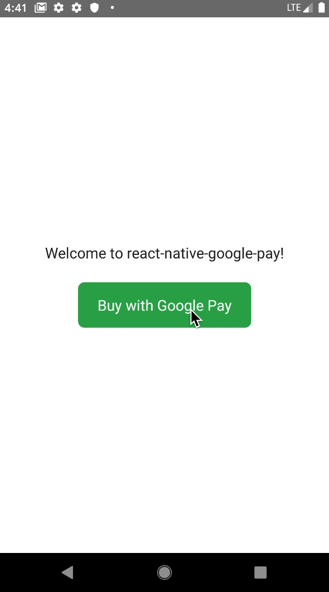

# react-native-google-pay
[](https://github.com/facebook/react-native/releases/tag/v0.41.0)

[](https://github.com/busfor/react-native-google-pay/tree/master)

Accept Payments with Google Pay for React Native apps.

<div>

</div>

---

## Versions

| 1.x              | 2.x              |
| ---------------- | -------------    |
| Android support  | AndroidX support  |


## Getting started

`$ yarn add react-native-google-pay`

## Linking 

### >= 0.60

Autolinking will just do the job.

### < 0.60

### Mostly automatic installation

`$ react-native link react-native-google-pay`

### Manual installation


#### Android

1. Open up `android/app/src/main/java/[...]/MainActivity.java`
  - Add `import com.busfor.RNGooglePayPackage;` to the imports at the top of the file
  - Add `new RNGooglePayPackage()` to the list returned by the `getPackages()` method
2. Append the following lines to `android/settings.gradle`:
  	```
  	include ':react-native-google-pay'
  	project(':react-native-google-pay').projectDir = new File(rootProject.projectDir, 	'../node_modules/react-native-google-pay/android')
  	```
3. Insert the following lines inside the dependencies block in `android/app/build.gradle`:
  	```
      implementation project(':react-native-google-pay')
  	```

### Enable Android Pay in your Manifest

To enable Google Pay in your app, you need to add the following Google Pay API meta-data element to the `<application>` element of your project's AndroidManifest.xml file.

```xml
<meta-data
    android:name="com.google.android.gms.wallet.api.enabled"
    android:value="true" />
```

## Usage
```javascript
import { GooglePay } from 'react-native-google-pay';

const allowedCardNetworks = ['VISA', 'MASTERCARD'];
const allowedCardAuthMethods = ['PAN_ONLY', 'CRYPTOGRAM_3DS'];

const requestData = {
  cardPaymentMethod: {
    tokenizationSpecification: {
      type: 'PAYMENT_GATEWAY',
      // stripe (see Example):
      gateway: 'stripe',
      gatewayMerchantId: '',
      stripe: {
        publishableKey: 'pk_test_TYooMQauvdEDq54NiTphI7jx',
        version: '2018-11-08',
      },
      // other:
      gateway: 'example',
      gatewayMerchantId: 'exampleGatewayMerchantId',
    },
    allowedCardNetworks,
    allowedCardAuthMethods,
  },
  transaction: {
    totalPrice: '10',
    totalPriceStatus: 'FINAL',
    currencyCode: 'USD',
  },
  merchantName: 'Example Merchant',
};

// Set the environment before the payment request
GooglePay.setEnvironment(GooglePay.ENVIRONMENT_TEST);

// Check if Google Pay is available
GooglePay.isReadyToPay(allowedCardNetworks, allowedCardAuthMethods)
  .then((ready) => {
    if (ready) {
      // Request payment token
      GooglePay.requestPayment(requestData)
        .then((token: string) => {
          // Send a token to your payment gateway
        })
        .catch((error) => console.log(error.code, error.message));
    }
  })
```

## Demo
You can run the demo by cloning the project and running:

`$ yarn demo`